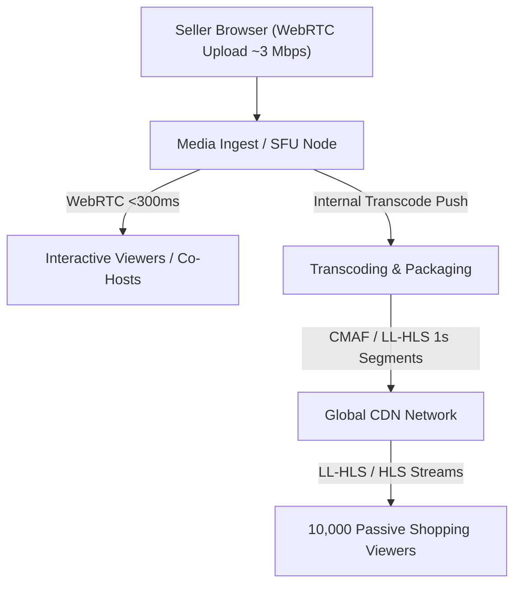

# Reneo WebRTC Assessment — Part C

This document answers the written architecture questions for the Reneo WebRTC assessment. The prototype itself is a two-party WebRTC call using native browser APIs, WebSocket signaling, STUN, ICE restart handling, `getStats()` telemetry, and additional media controls such as screen sharing and device switching. TURN, SFU infrastructure, CDN distribution, authentication, and production observability are discussed here as production recommendations, not as features implemented in this prototype.

## C1. Why can WebRTC work locally but fail across different networks?

On the same local network, two browsers may be able to reach each other through local ICE candidates. For example, both devices might be on the same Wi-Fi network with private addresses like `192.168.x.x`, so media packets can take a simple local path.

```text
Same network:

Browser A
   |
   | local candidate
   v
Browser B
```

Across different networks, each browser is usually behind NAT, a firewall, or both. The private address that worked locally is not reachable from the public internet. WebRTC uses ICE to test possible candidate paths: local candidates, server-reflexive candidates discovered with STUN, and relay candidates from TURN if configured.

```text
Different networks:

Browser A
   |
   | NAT / Firewall
   v
Internet
   |
   | NAT / Firewall
   v
Browser B
```

STUN helps a browser discover how it appears from the public internet, but it does not relay media. Some NAT and firewall combinations still prevent the two peers from sending UDP media directly to each other. That is why a call can pass during local testing and fail in real user networks unless TURN relay fallback is available.

## C2. What is the role of TURN?

TURN is a media relay. STUN helps discover connectivity information; TURN carries the actual audio and video when a direct peer-to-peer path cannot be established. In this prototype, TURN is not configured. The prototype uses public STUN only, which is fine for the assessment but not enough for production reliability.

In production, I would deploy TURN servers in multiple regions close to users. Clients should try UDP first because it is usually the best transport for real-time media. When UDP is blocked, the ICE configuration should also offer TCP and TLS TURN fallback, commonly on ports that pass through restrictive networks.

TURN must not be an open relay. I would issue short-lived TURN credentials from the application backend after the user is authenticated, using an expiring username and HMAC-style credential. I would also add rate limiting, per-user allocation limits, monitoring, bandwidth alerts, and abuse prevention so the relay cannot be used as free public infrastructure.

The cost difference is simple: STUN is mostly discovery traffic, while TURN can carry the full media stream. TURN therefore adds bandwidth cost, egress cost, infrastructure cost, and operational complexity. TURN cost depends heavily on traffic volume, region, provider, and whether it is self-hosted or managed.

## C3. How would you handle an ICE restart?

An ICE restart asks the existing `RTCPeerConnection` to find a new network path without ending the call or reacquiring camera and microphone tracks. It creates new ICE credentials and gathers new candidates, then sends a new offer/answer exchange through the existing signaling channel.

I would not restart ICE for every brief `disconnected` event. A short network drop, Wi-Fi jitter, or mobile packet loss may recover automatically. A better trigger is a persistent `failed` ICE state, or a disconnected state that lasts beyond a grace period. The prototype follows that general approach by treating `failed` as the restart trigger and bounding the number of restart attempts.

```text
Connection problem
       |
       v
Check connection state
       |
       +---- recovers ----> Connected
       |
       +---- failed ------> ICE restart
                              |
                              v
                         New offer
                              |
                              v
                         New answer
                              |
                              v
                        New ICE path
```

In code, the initiator creates a new offer with:

```ts
createOffer({ iceRestart: true })
```

The flow is: create a new offer, set it as the local description, send it through WebSocket signaling, have the remote peer set it as the remote description, create and set an answer, return that answer, and then exchange new ICE candidates. I would add retry limits and backoff so two unstable clients do not create an infinite renegotiation loop.

## C4. Architecture for 10,000 Live Shopping Viewers

The seller's browser should publish once. The distribution layer should handle fan-out.

Sending 10,000 WebRTC streams directly from the seller's browser is not practical. It would require 10,000 outbound peer connections, huge uplink bandwidth, repeated encoding or packetization work, a large memory footprint, and complex connection management inside a consumer browser. It would also be unreliable because the seller might be on Wi-Fi, mobile data, or a normal home/office network. The seller should not become the broadcast infrastructure.

### P2P, SFU, and MCU

| Architecture | Strength | Weakness | Best fit |
| ------------ | -------- | -------- | -------- |
| P2P | Direct peer connection with no media server | Does not scale to large rooms or audiences | One-to-one calls and very small sessions |
| SFU | Receives media once and forwards streams with low latency | Requires media infrastructure and bandwidth planning | Interactive rooms, co-hosts, moderators, small live groups |
| MCU | Mixes/transcodes streams into a composed output | Higher CPU cost and added processing latency | Server-side layouts, recordings, compatibility-focused conferencing |

P2P is the right mental model for this prototype: two participants join a room and exchange media directly after WebSocket signaling. For live shopping at 10,000 viewers, P2P is the wrong distribution model. An SFU is useful for low-latency interactive participants because it forwards media without fully mixing it. An MCU makes sense when the server must compose a single output, but it is heavier because it decodes and re-encodes media.

### Recommended Architecture



I would use a hybrid architecture. The seller publishes a single WebRTC stream to media infrastructure. Co-hosts, moderators, or highly interactive buyers can stay on a WebRTC/SFU path because they need low latency and possibly two-way media. The large passive audience should receive LL-HLS or HLS through a CDN, because CDN distribution is much better suited to thousands of viewers.

The exact split depends on the product requirement. If a viewer needs to speak to the seller in real time, WebRTC is appropriate. If a viewer is mostly watching, browsing products, chatting, and clicking buy buttons, a few seconds of video latency is usually acceptable and much cheaper to scale.

### WebRTC vs HLS vs LL-HLS

| Technology | Latency | Scalability | Best use |
| ---------- | ------- | ----------- | -------- |
| WebRTC | Very low | Lower without specialized media infrastructure | Two-way calls, co-hosts, auctions, moderation |
| HLS | Higher | Very high through CDNs | Large passive audiences where latency is less important |
| LL-HLS | Lower than HLS | High with CDN support | Large audiences where a few seconds of latency is acceptable |

Lower latency usually requires more real-time infrastructure: SFUs, TURN, active connection state tracking, and more operational work. Higher latency allows better CDN caching and simpler viewer delivery. The trade-off is not "WebRTC good, HLS bad"; it is latency versus cost, reach, and operational complexity.

### Mobile Networks

If many viewers are on mobile networks, the system should assume unstable bandwidth, packet loss, higher RTT, changing network conditions, data limits, and weaker devices. The goal is graceful degradation, not forcing every viewer to receive one high-bitrate stream.

For the WebRTC path, I would use quality adaptation where appropriate, such as simulcast or SVC, and monitor RTT, packet loss, bitrate, and frame rate. Audio should be protected because understandable audio matters more than perfect video during commerce conversations.

For the large passive audience, I would generate an adaptive bitrate ladder and let the player switch between quality levels. A viewer on a weak network can fall back to a lower resolution instead of buffering or dropping from the event. CDN delivery also helps mobile viewers by serving segments from a nearby edge.

For 10,000 viewers, my recommendation is publish-once architecture: the seller publishes to media infrastructure, interactive participants use WebRTC/SFU where low latency matters, and the large passive audience receives LL-HLS/HLS through a CDN. This keeps the seller's uplink independent of audience size while letting the system trade latency for scale where appropriate.
