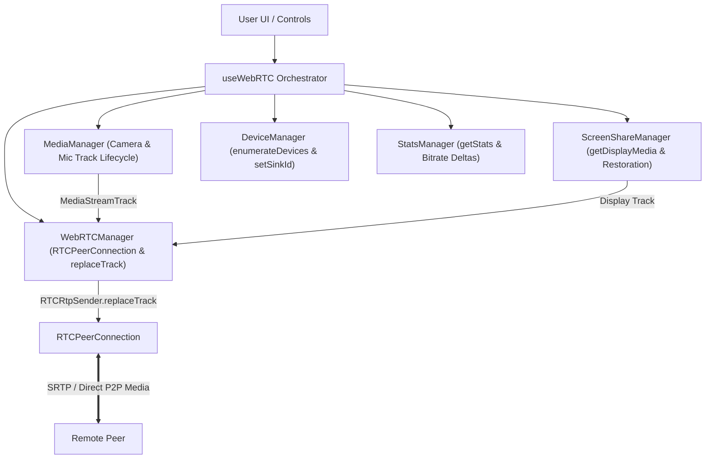
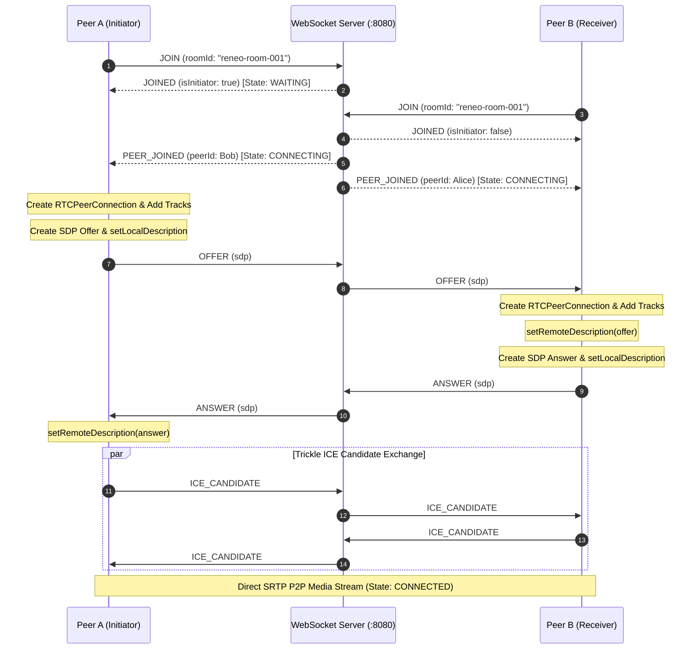
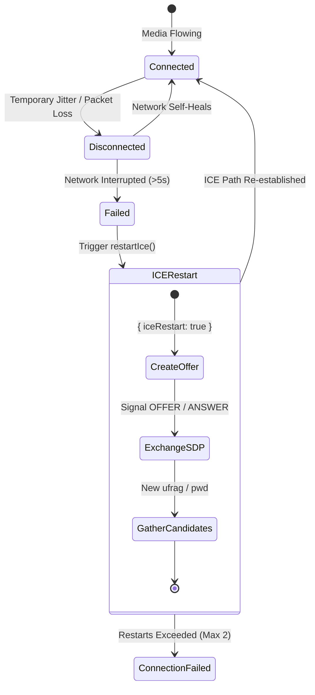
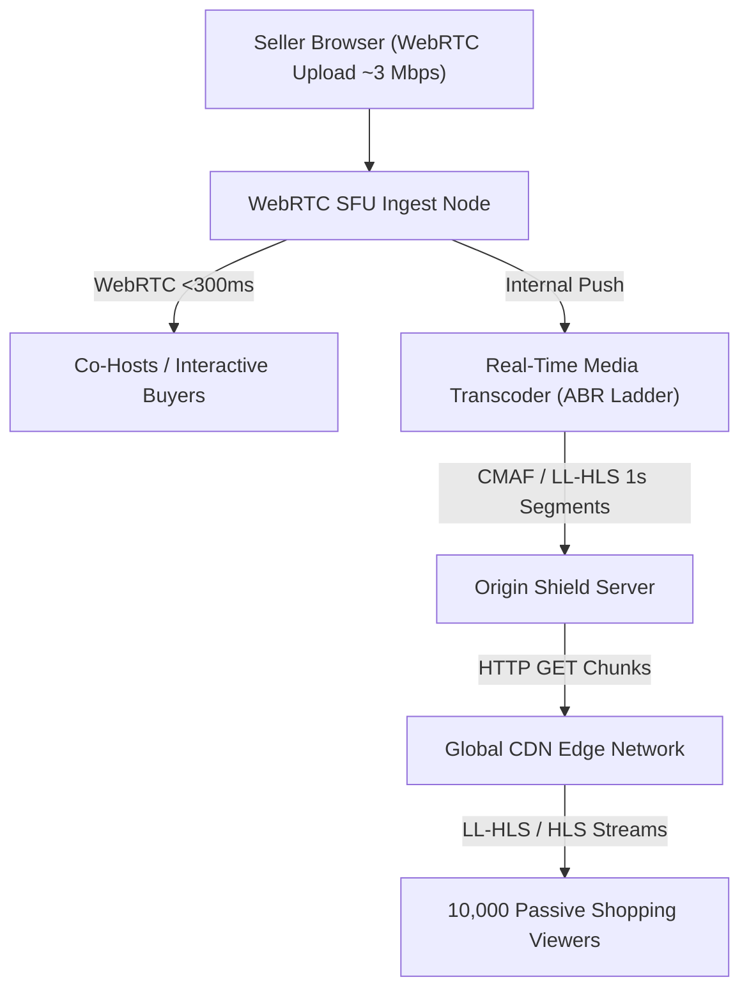

# Reneo WebRTC Assessment

Production-principled, zero-magic 2-party WebRTC video calling application built for the **Reneo WebRTC / Live Streaming Internship Technical Assessment**.

This implementation uses **native browser WebRTC APIs** directly (`RTCPeerConnection`, `getUserMedia`, `getDisplayMedia`, `getStats`, `RTCRtpSender.replaceTrack`) without hiding WebRTC concepts behind high-level abstraction libraries (such as PeerJS, LiveKit, or mediasoup).

---

## Overview

The application enables two participants to enter a shared Room ID, negotiate a peer-to-peer audio/video connection using WebSocket signaling, handle network interruptions via ICE restart, monitor connection stats in real time via a `getStats()` telemetry engine, and handle all common media and connectivity failure modes gracefully with visible user feedback.

---

## Part B Selection & Additional Enhancements

> **Selected Assessment Part B Feature: B3 — Connection Quality Panel**

### Why Option B3 Was Selected:
In real-time commerce (such as Reneo's buyer-seller video calls and live streaming), media transport observability is critical. `RTCPeerConnection.connectionState === 'connected'` only indicates that network sockets are bound; it does not guarantee adequate video resolution, packet delivery, or low jitter for a commerce transaction. 

Implementing a live `getStats()` telemetry engine directly addresses the core WebRTC principle: **"Connected does not mean the call is good."** By calculating byte deltas for real-time inbound bitrate, tracking candidate-pair RTT, packets lost, jitter, resolution, and FPS, both users and developers gain transparent, diagnostic visibility into call health.

---

### Additional Engineering Enhancements: B1 & B2

To demonstrate deeper WebRTC media architecture knowledge beyond the minimum brief requirement, this prototype additionally implements:

- **B1 — Screen Sharing**: Full display capture via `navigator.mediaDevices.getDisplayMedia()` seamlessly replacing the outgoing video track on the active `RTCRtpSender` without tearing down `RTCPeerConnection` or triggering SDP renegotiation. Automatically restores original camera track upon ending (including native browser bar clicks).
- **B2 — Device Switching**: Professional device management interface for Microphone, Camera, and Speaker (`setSinkId`) with `devicechange` hot-plugging support, non-blocking track replacement, and failure preservation.

---

## Advanced WebRTC Media Management & Architecture

The application features a dedicated, modular WebRTC media control layer:



### Key Architectural Principles:
1. **Media Source Decoupling**: A media source (camera, microphone, or display share) produces a `MediaStreamTrack`. The track flows into an `RTCRtpSender` on the active `RTCPeerConnection`.
2. **Seamless Track Replacement**: When the user switches cameras or starts screen sharing, we invoke `await sender.replaceTrack(newTrack)`.
3. **Zero SDP Renegotiation**: `replaceTrack()` swaps the media source feeding the RTP packetizer without altering session codecs or transport parameters. **Zero `createOffer()`, zero `createAnswer()`, and zero peer connection rebuilds** occur during screen sharing or device switching.
4. **Track Lifecycle Safety**: Original camera tracks are preserved in memory during screen sharing so they can be restored instantly. When switching hardware devices, new tracks are acquired and verified *before* old tracks are stopped to prevent media disruption.

---

## Features Matrix

- 📹 **Camera & Microphone Access**: Safe capture using `navigator.mediaDevices.getUserMedia()`.
- 🔄 **Deterministic SDP Offer/Answer Negotiation**: Initiator (Participant A) creates SDP offer; Receiver (Participant B) creates SDP answer.
- 🧊 **Trickle ICE & STUN**: Public STUN candidate gathering (`stun:stun.l.google.com:19302`) and queued candidate exchange.
- 🎛️ **Media Controls**: Mute/unmute microphone and enable/disable camera via `track.enabled` without destroying or rebuilding `RTCPeerConnection`.
- 📊 **Connection Quality Panel (Part B3 - Selected Feature)**: Real-time `getStats()` polling engine displaying live Inbound Bitrate (byte deltas), RTT, Packets Lost, Packet Loss %, Jitter, Resolution, FPS, and semantic rating (`Excellent`, `Good`, `Fair`, `Poor`).
- 🖥️ **Screen Sharing (Enhancement B1)**: In-call display capture via `getDisplayMedia()` with `replaceTrack()` and automatic `screenTrack.onended` camera restoration.
- 🎙️ **Device Switching (Enhancement B2)**: Dynamic dropdown enumeration (`enumerateDevices`), `devicechange` hot-plugging, microphone/camera switching, and speaker routing (`setSinkId`).
- 🔁 **ICE Restart Recovery**: Bounded automatic recovery mechanism when ICE connectivity fails.
- ⚠️ **Comprehensive Error & Recovery Banners**: Clear user-facing status messages for permission denied, device not found, abrupt peer disconnects, temporary network drops, and room capacity limits.
- 🔒 **Deterministic Signaling Server**: Node.js + TypeScript WebSocket server using `ws` with strict room capacity limits (max 2) and sanitized message validation.

---

## Technology Stack

- **Frontend**: React 19, TypeScript (Strict Mode), Vite, Vanilla CSS.
- **Backend**: Node.js, TypeScript (Strict Mode), WebSocket (`ws`).
- **WebRTC**: Native browser WebRTC APIs (`RTCPeerConnection`, `MediaStream`, `getStats`, `getDisplayMedia`, `replaceTrack`).
- **STUN Server**: `stun:stun.l.google.com:19302`.

---

## Project Structure

```
reneo-webrtc-assessment/
├── client/                     # React + TypeScript + Vite Frontend (Port 3000)
│   ├── src/
│   │   ├── components/         # UI Components (DeviceSelector, ScreenShareControl, QualityPanel, etc.)
│   │   ├── hooks/              # Custom Hooks (useWebRTC, useDevices, useScreenShare, useConnectionStats)
│   │   ├── services/           # Service Layer
│   │   │   └── webrtc/         # WebRTC Architecture Modules
│   │   │       ├── WebRTCManager.ts     # Core PeerConnection & replaceTrack
│   │   │       ├── MediaManager.ts      # Local Camera/Mic Track Lifecycle
│   │   │       ├── ScreenShareManager.ts# Display Capture & Restoration
│   │   │       ├── DeviceManager.ts     # Device Enumeration & setSinkId
│   │   │       └── StatsManager.ts      # getStats Polling & Rating
│   │   ├── types/              # TypeScript Interfaces (WebRTC, Devices, ScreenShare, Stats)
│   │   ├── App.tsx             # Root Application Component
│   │   └── styles.css          # Design System & Styling
│   ├── package.json
│   ├── tsconfig.app.json       # Strict TypeScript Config ("strict": true)
│   └── vite.config.ts          # Vite Config (Port 3000)
├── server/                     # Node.js + TypeScript WebSocket Server (Port 8080)
│   ├── src/
│   │   ├── rooms/              # RoomManager (2-participant limit & role assignment)
│   │   ├── signaling/          # WebSocket Server & Message Routing
│   │   └── index.ts            # Server Entry Point
│   ├── package.json
│   └── tsconfig.json
├── ANSWERS.md                  # Comprehensive Answers to Part C (C1-C4 + Diagram)
├── ADVANCED-FEATURE-TESTS.md   # Verification Test Suite for B1, B2, B3 & Edge Cases
├── INTERVIEW-WALKTHROUGH.md    # Senior WebRTC Q&A for Technical Follow-up Interview
├── DEMO_RECORDING_GUIDE.md     # 3 to 5 Minute Screen Recording Script & Walkthrough Guide
├── ASSESSMENT-CHECKLIST.md     # Requirements Matrix
├── FINAL-SUBMISSION-CHECKLIST.md # Audit Matrix Verifying Requirements Coverage
└── README.md
```

---

## Local Setup & Quickstart

### Prerequisites
- **Node.js**: v18.0.0 or higher
- **npm**: v9.0.0 or higher

### Installation
From the repository root, install all dependencies for root, server, and client:

```bash
npm run install:all
```

---

## Running the Application

From root:
```bash
npm run dev
```

- **Signaling Server**: Runs on `ws://localhost:8080`
- **Client Frontend**: Runs on `http://localhost:3000`

---

## Testing With Two Browsers

1. Open `http://localhost:3000` in **Browser Window 1** (e.g., Chrome).
2. Enter Room ID: `reneo-room-001` and Name: `Alice`. Click **Join Call**.
3. Allow camera/microphone access. The app transitions to `WAITING` state ("Waiting for another participant to join...").
4. Open `http://localhost:3000` in **Browser Window 2** (or Incognito Window / Firefox).
5. Enter Room ID: `reneo-room-001` and Name: `Bob`. Click **Join Call**.
6. **Result**:
   - Both browsers perform SDP Offer/Answer exchange and Trickle ICE candidate exchange.
   - Both transition to `CONNECTED` state.
   - Local and Remote video/audio streams play back live.
   - Connection Quality Panel (Part B3) updates live metrics every second.
   - Click **Share Screen** to test B1 Screen Sharing.
   - Click **Device Settings** to test B2 Device Switching.

---

## WebRTC Signaling Sequence Diagram



---

## Screen Recording & Code Walkthrough Video

- 📺 **Video Recording Status**: Screen recording script is prepared in [`DEMO_RECORDING_GUIDE.md`](DEMO_RECORDING_GUIDE.md). Video link will be attached prior to final candidate submission.

---

## Part C — Architecture & WebRTC Reasoning

The prototype is a two-party WebRTC call using native browser APIs, WebSocket signaling, STUN, ICE restart handling, and a `getStats()` quality panel. It also includes screen sharing and device switching as additional media-control work. The production architecture described below is not implemented in this prototype; it is the design I would propose for the live-shopping problem.

For the standalone Part C answer, see [ANSWERS.md](ANSWERS.md).

### C1 — Why WebRTC Can Work Locally but Fail Across Networks

On the same local network, two browsers may be able to connect using local ICE candidates (`type host`). Both devices can reach each other through private LAN addresses. Across different networks, each browser operates behind NAT or firewalls, making private IPs unreachable from the public internet.

ICE tests candidate paths between peers. STUN helps discover server-reflexive addresses (`type srflx`), but STUN fails behind Symmetric NATs (which assign unique external ports for each distinct destination) or strict corporate firewalls. Production systems mandate TURN relay servers (`turns:443`).

### C2 — TURN

TURN is a relay protocol (RFC 5766) that proxies WebRTC media when direct P2P connection attempts fail (`Client A ──> TURN Server ──> Client B`).

In production, TURN servers are secured using short-lived HMAC-SHA1 tokens (REST API Authentication). TURN servers are deployed across multiple geographical regions with UDP (port 3478) primary transport and TCP/TLS (port 443) fallback. TURN incurs direct bandwidth and infrastructure egress costs proportional to media volume.

### C3 — ICE Restart

An ICE restart recovers a broken peer connection without destroying the `RTCPeerConnection` instance or recreating media tracks. The ICE agent generates new credentials (`ice-ufrag` and `ice-pwd`) and restarts candidate gathering.



### C4 — Architecture for 10,000 Live Shopping Viewers

Sending 10,000 WebRTC streams directly from the seller's browser is unfeasible—it would require ~20 Gbps upload bandwidth. 

To solve this, we use a hybrid architecture:
- **Interactive Co-Host Path (WebRTC)**: Seller and interactive buyers connect via **WebRTC to SFU** for sub-300ms two-way interaction.
- **Mass Audience Path (LL-HLS)**: The SFU forwards the seller's stream to a Real-Time Transcoder, creating an Adaptive Bitrate (ABR) ladder (1080p, 720p, 480p, 360p) packaged as CMAF / LL-HLS 1-second chunks and served via a global CDN Edge network (1.5-3.0s latency) with >99% edge cache hit ratio.



| Technology | Latency | Scalability | Primary Use Case |
| :--- | :--- | :--- | :--- |
| **WebRTC** | Very Low (<300ms) | Lower without large SFU infra | 1-on-1 calls, interactive co-hosts, real-time auctions |
| **HLS** | Higher (6-12s) | Extremely High via CDN | Standard mass streaming |
| **LL-HLS / CMAF** | Low (1.5-3s) | High via CDN Edge | Scalable live shopping broadcasts |

---

## AI Usage Disclosure

AI assistance (Gemini 3.6 Flash / Antigravity Agent) was used to accelerate boilerplate generation, assist with CSS design system tokens, and draft markdown structure. All core WebRTC service logic, SDP candidate queuing, signaling validation, state machine mapping, strict TypeScript compliance, and architectural documentation were authored and verified according to the Reneo assessment brief.
